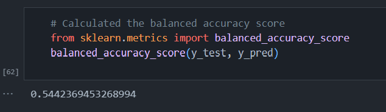
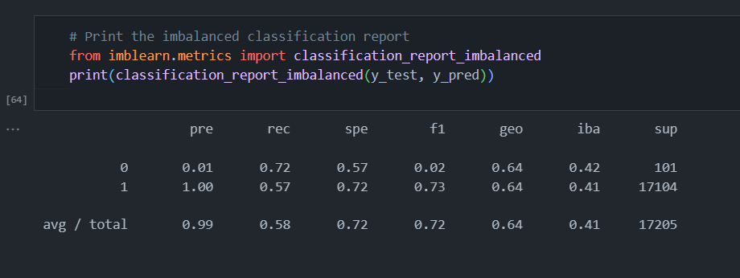
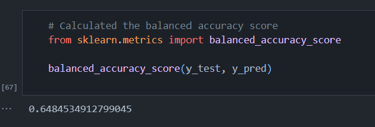
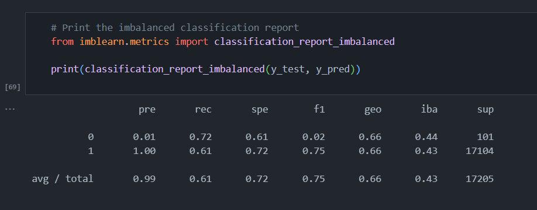
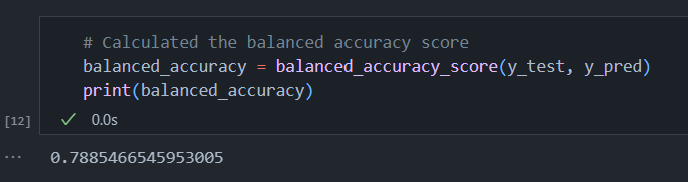
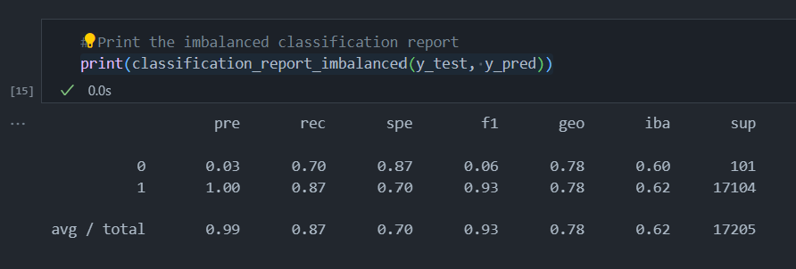
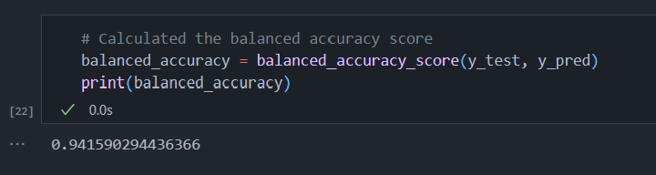
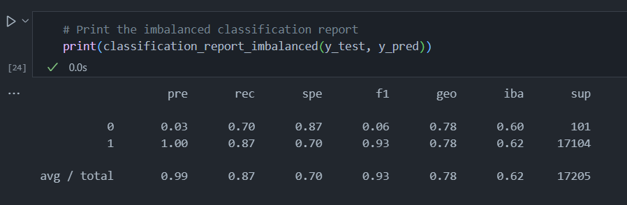

# Module 18: Supervised Machine Learning and Credit Risk

## Overview

The purpose of this analysis was to evaluate the performance of six machine learning models in evaluation credit risk for LendingClub, a peer-to-peer lending services company. The models we evaluated are as follows:

### Oversampling Models
* RandomOverSampler
* SMOTE

### Undersampling Model
* ClusterCentroids

### Combinatorial Model
* SMOTEENN

### Ensemble Models
* BalancedRandomForestClassifier
* EasyEnsembleClassifier

## Results
#### Naive Random Oversampling

#### SMOTE

#### Cluster Centroids

#### SMOTEENN

#### Balanced Random Forest Classifier

#### Easy Ensemble Ada Boost

