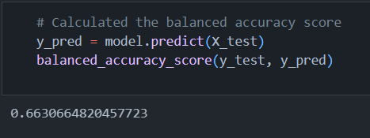
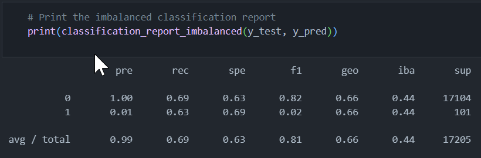

# Module 18: Supervised Machine Learning and Credit Risk

## Overview

The purpose of this analysis is to evaluate the performance of six machine learning models in evaluation credit risk for LendingClub, a peer-to-peer lending services company. The models we evaluated are as follows:

### Oversampling Models
* RandomOverSampler
* SMOTE

### Undersampling Model
* ClusterCentroids

### Combinatorial Model
* SMOTEENN

### Ensemble Models
* BalancedRandomForestClassifier
* EasyEnsembleClassifier

## Results

According to Stephen Allwright [Stephen Allwright](https://stephenallwright.com/balanced-accuracy/), a good accuracy score is "entirely dependent upon your use case and dataset." However, he does say that most data scientists use the following rule of thumb:

* Over 0.9 - Very good
* Between 0.7 and 0.9 - Good
* Between 0.6 and 0.7 - OK
* Below 0.6 - Poor

When it comes to precision and recall scores, there is always a tension between the two. Higher precision is more important when we want to be more confident of our true positives; that is, we want to be more confident that the loans our model lables as high-risk actually are high-risk. Higher recall is more important when we have a low tolerance for false negatives; that is, we don't want to miss any high-risk loans and we're willing to deal with some "false alarms". As we are interested in identifying the maximum number of high-risk loans, we are more interested in the recall scores.

Let's take a look at the performance of our models.

#### Naive Random Oversampling

* The RandomOverSampler algorithm returned a balanced accuracy score of 0.6409, which would be considered "OK" according to the rule of thumb (RoT).

* The RandomOverSampler algorithm returned an extremely low precision score of 0.01 and a middling recall score of 0.69.

#### SMOTE

* The SMOTE algorithm returned a balanced accuracy score of 0.6631, which is considered "OK" according to the RoT.

* The SMOTE algorithm returned an extremely low precision score of 0.01 and a middling recall score of 0.63, slightly lower than RandomOverSampler.

#### Cluster Centroids

* The ClusterCentroids algorithm returned a balanced accuracy score of 0.6630, an "OK" score and almost exactly the same as the SMOTE algorithm.

* The ClusterCentroids algorithm returned an extremely low precision score of 0.01 and a middling recall score of 0.69.

#### SMOTEENN

* The SMOTEENN algorithm returned a balanced accuracy score barely better than random chance at 0.5443, which is considered "poor" by the RoT.

The SMOTEENN algorithm returned an extremely low precision score of 0.01, but a good recall score of 0.77.

#### Balanced Random Forest Classifier

* The BalancedRandomForest algorithm returned a balanced accuracy score of 0.7666, which is considered "good" according to the RoT.

The BalancedRandomForest algorithm returned an extremely low precision score of 0.03, and a middling recall score of 0.64.

#### Easy Ensemble Ada Boost

The EasyEnsemble and AdaBoost algorithm returned a balanced accuracy score of 0.9416, which is considered "very good" according to the RoT.

The EasyEnsemble and AdaBoost algorithm returned an extremely low precision score of 0.03, and a middling recall score of 0.64.

## Summary

In terms of accuracy scores, the ensemble classifiers performed the best. However, the model that returned the best recall score was the combinatorial classifier SMOTEENN. It is difficult to recommend one of these models over all the others, but the Easy Ensemble Ada Boost algorithm seems to offers the best balance of accuracy and recall. It would be a good idea to run some more tests on our data with this algorithm. 